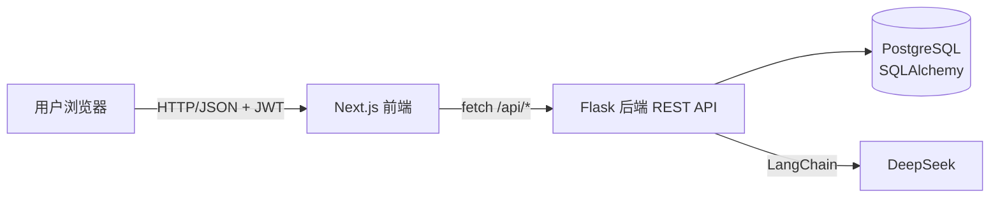
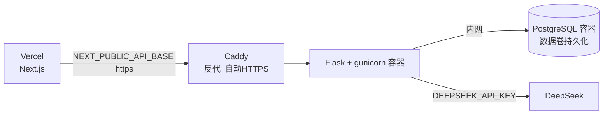

# Vita 架构设计文档

> 多用户 AI 生活管家。前端 Next.js，后端 Flask，数据 PostgreSQL，AI 经后端 → LangChain → DeepSeek。
> JWT 鉴权，数据按用户隔离。本文是实现依据与关键架构决策记录。

## 1. 系统概览



- 前端只经 `NEXT_PUBLIC_API_BASE` 调后端，不直连 DeepSeek（密钥不暴露）。
- 后端负责鉴权、业务校验、持久化；AI 调用统一收敛到 `services/ai_service.py`。
- 除注册/登录/健康检查外，所有接口需 JWT，并按 `user_id` 过滤数据。

## 2. 技术选型
| 层 | 选型 | 理由 |
|---|---|---|
| 前端 | Next.js(App Router)+TS+Tailwind | 路由清晰、UI 快、Vercel 部署 |
| 后端 | Flask + Flask-SQLAlchemy | 轻量、与 LangChain 同生态 |
| 鉴权 | flask-jwt-extended + werkzeug 哈希 | 无状态、跨域友好 |
| DB | PostgreSQL（本地可 SQLite，env 切换） | 关系型数据、聚合统计方便 |
| AI | LangChain + DeepSeek | 契合主题；OpenAI 兼容端点 |

## 3. 目录结构
```
backend/
├── app.py            # create_app 工厂 + 蓝图注册 + /api/health
├── config.py         # 读环境变量
├── extensions.py     # db / jwt 等扩展实例
├── models.py         # users/categories/transactions/reminders/chat_messages/settings
├── errors.py         # 统一错误处理
├── seed.py           # 幂等初始化分类
├── blueprints/       # auth / finance / reminders / ai
├── services/         # ai_service(LangChain) / prompts(角色)
├── tests/            # pytest
├── requirements.txt
└── .env.example
frontend/             # Next.js（create-next-app 生成）
```

## 4. 数据模型
| 表 | 字段 | 约束 |
|---|---|---|
| users | id, username(unique), password_hash, created_at | 密码仅存哈希 |
| categories | id, name, kind(expense/income) | 种子数据 |
| transactions | id, user_id(FK), type, amount(Numeric,>0), category, note, date, created_at | 校验金额/类型/日期 |
| reminders | id, user_id(FK), title, due_at, type, done, note, created_at | title 非空、日期合法 |
| chat_messages | id, user_id(FK), role, content, persona, created_at | 保存对话 |
| settings | id, user_id(FK), key, value | 存当前角色等 |

时间统一用带时区 DateTime 存 UTC；金额用 Numeric(10,2)。

## 5. AI 角色服务设计（核心难点）
统一在 `services/ai_service.py`：

| 能力 | 输入 | 输出 | 关键点 |
|---|---|---|---|
| chat | role + message + history | 文本 | 角色 system prompt 控制语气 |
| brief | role + 当日聚合数据 | 播报文本 | 只喂当日数据控制长度 |
| parse | 自然语言 | 结构化 JSON | Pydantic + 失败正则兜底 |

- **4 角色**：butler(管家)/servant(奴才)/sassy(毒舌闺蜜)/lover(暖心恋人)，各一段 system prompt，集中在 `prompts.py`。
- **DeepSeek 接入**：`ChatOpenAI(base_url="https://api.deepseek.com", model="deepseek-chat", api_key=env)`。
- **降级（重点）**：无 key / 超时 / 异常 / 非法 JSON → chat/brief 返回角色静态兜底文案；parse 返回 intent=unknown；一律不抛 500。
- **上下文控制**：history 取最近 6 轮、单条截断 500 字。

## 6. 鉴权设计
- 注册：用户名唯一 + 密码哈希入库。
- 登录：校验后签发 JWT（含 user_id，设过期）。
- 保护：业务接口用 `@jwt_required`，从 token 取 user_id，查询按 user_id 过滤，越权返回 404。
- `JWT_SECRET` 走环境变量。

## 7. 关键决策 & 疑难预案
| 问题 | 方案 |
|---|---|
| LLM 超时/Key 失效 | 惰性初始化 + 降级文案，绝不 500 |
| 自然语言解析不稳 | 结构化 + JSON 容错 + 正则兜底，失败 unknown |
| 密钥泄露 | 只后端读 env；前端无 key；`.env` 进 .gitignore |
| CORS | flask-cors 按 FRONTEND_ORIGIN 放行 |
| 数据库连接 | DATABASE_URL 兼容 postgres:// 自动改写；pool_pre_ping=True |
| 部署持久化 | Postgres 数据卷持久化；数据库不对公网暴露 |

## 8. 部署架构（自建云服务器）

- docker-compose：db(不暴露端口) + backend(gunicorn) + caddy(80/443)。
- 前端 Vercel，`NEXT_PUBLIC_API_BASE=https://api.<域名>`。
- 防火墙仅开 22/80/443；定期 pg_dump 备份。

## 9. 工程化（加分项）
- 日志：AI 调用与异常记录。
- 单元测试：`backend/tests/` 覆盖校验与 AI 降级。
- 环境变量：密钥/连接串全部走 env。
- 可选 CI/CD：GitHub Actions。
